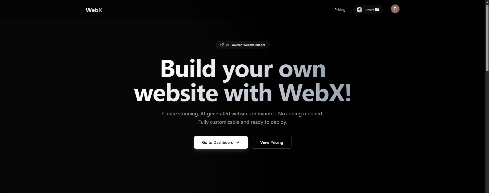
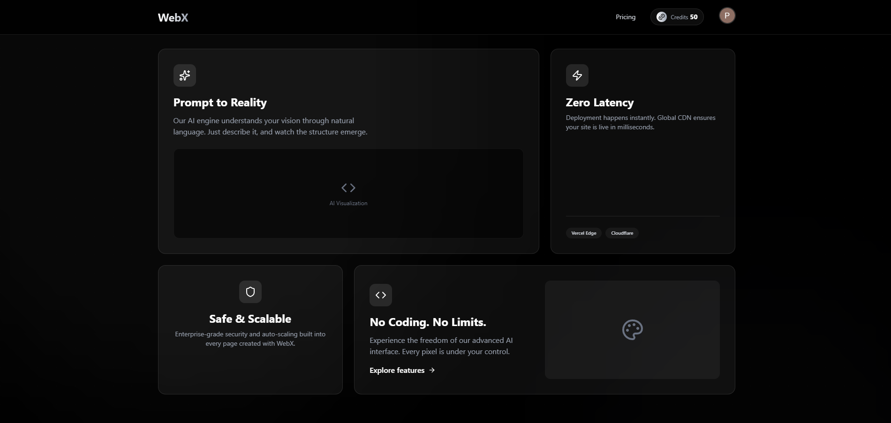
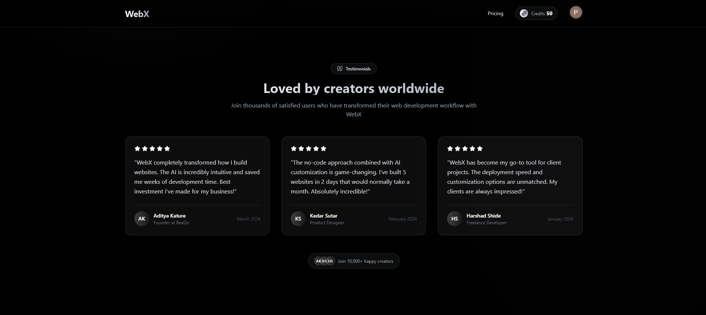
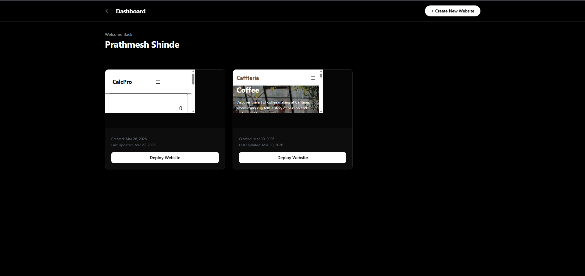
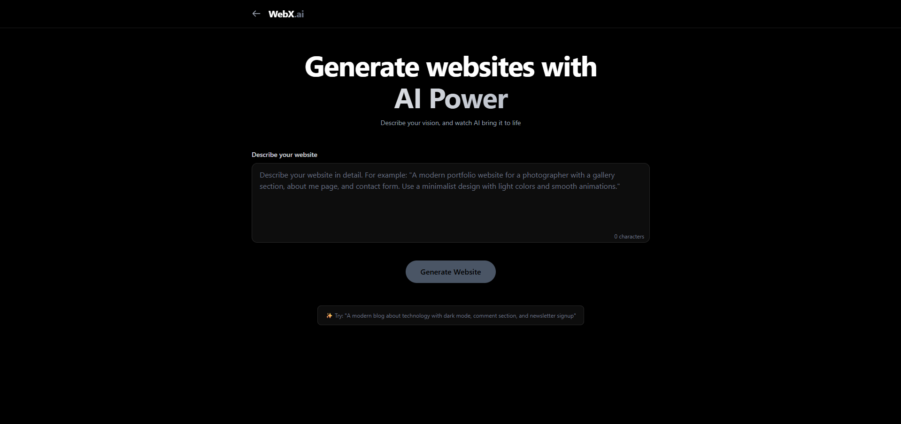
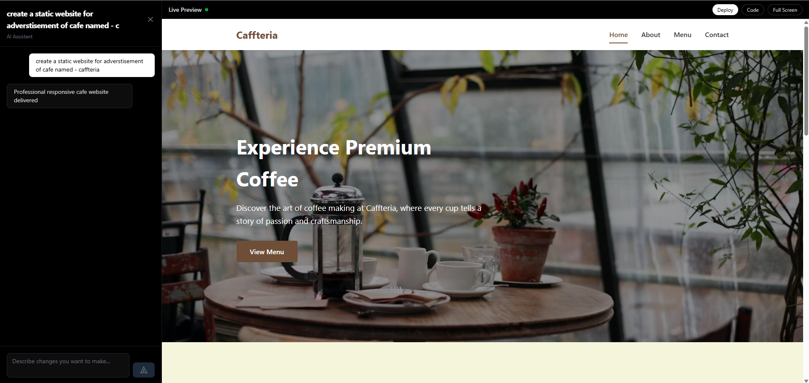

# WebX frontend
A modern, responsive frontend for the WebX platform — built with scalability, clean UI, and real-world architecture in mind.

# About the project
WebX Frontend is the client-side application of the WebX platform, focused on delivering a smooth and intuitive user experience.

This project is not just about building UI — it’s about creating a structured, scalable frontend similar to real production applications.

It focuses on:

 - Clean component architecture
 - Maintainable and readable code
 - Seamless backend integration

# Tech Stack

 - React.js
 - JavaScript (ES6+)
 - Tailwind CSS
 - React Router
 - Axios
 - Vite


# Features

 - Authentication UI (Login / Signup)
 - Fast and responsive design
 - Reusable components
 - Backend API integration
 - Mobile-friendly layout
 - Clean routing and structure

# Project Structure
```bash


src/
├── components/     # Reusable UI components
├── pages/          # Screens / routes
├── assets/         # Static files
├── utils/          # Helper functions
├── App.jsx         # Root component
└── main.jsx        # Entry point
```

# Preview









# Backend
 This frontend connects with the WebX backend for:

 - Authentication
 - Data fetching
 - API communication

-> Backend Repo:
https://github.com/thepratham21/WebX-backend

# Support 
If you found this project helpful, consider giving it a ⭐

# Author
Prathmesh Shinde  
Building and Learning ~


